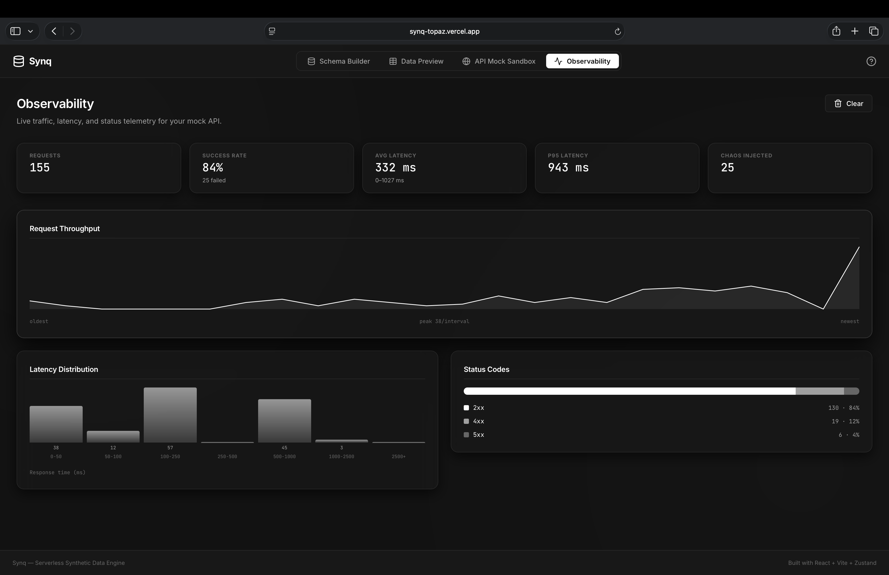

# Synq — Serverless Synthetic Data Engine & API Mocker

[](https://github.com/jaryalarshita/synq/actions/workflows/ci.yml)

**Synq** is a high-performance, serverless developer tool that runs entirely in the browser. It lets you visually define relational database schemas, generate thousands of realistic synthetic records with cascading foreign-key integrity, preview and filter data inside an interactive grid, export schemas/datasets in multiple formats, and test mock REST API endpoints using a built-in request runner—all without any backend server.

Built with **React, Vite, and Zustand**, Synq features a premium dark-mode, glassmorphic layout optimized for technical developer workflows.

---

## 📸 Screenshot

> **TODO:** run `npm run dev`, capture the Schema Builder / Data Preview / API
> Sandbox views, save the image to `docs/screenshot.png`, then uncomment the
> line below.

<!--  -->


---

## 🚀 Features

### 1. Visual Schema Builder
* **Entity Management**: Visually construct tables (entities) and define custom columns.
* **Inline Renaming**: Double-click table headers to dynamically edit names with alphanumeric validation.
* **Relations Mapping**: Model 1-to-many relationships by setting fields to `Foreign Key` targets referencing other tables.
* **Supported Column Types**: `UUID`, `String`, `Email`, `Number`, `Currency`, `Date`, `Boolean`, `Enum` (comma-separated entries), and `Foreign Key`.

### 2. Relational Synthetic Data Engine
* **Topological Sort**: Evaluates database schema dependency hierarchies to generate parent records before children, preventing foreign-key constraints violations.
* **Cycle Detection**: Identifies circular references (loops) and alerts the user with descriptive warnings.
* **Smart Data Generator**: Leverages `@faker-js/faker` combined with smart name-matching filters (e.g. fields named "email" produce email templates; "age" yields numbers between 18-80) to produce highly realistic data mockups.

### 3. Interactive Data Grid & Exporters
* **Filter & Search**: Query records across columns inside a paginated (25 items per page) grid.
* **Column Sorting**: Click table headers to toggle sorting directions (ascending/descending arrow indicators).
* **Format Exporters**:
  * **JSON**: Pretty-printed file download of datasets.
  * **CSV**: Generates escaped flat CSV files (seperate files triggered sequentially for multi-table scopes).
  * **SQL**: Downloader for SQL `INSERT INTO` statements chunked by 500 lines, keeping insertions topologically sorted.

### 4. REST API Mock Sandbox
* **Routing Interceptor**: Dispatch simulated HTTP queries against generated datasets inside the browser using standard routes:
  * `GET /api/[entity]` (supports pagination: `?limit=10&page=2`, global searches `?search=john`, and exact column filters `?role=admin`)
  * `GET /api/[entity]/:id` (record primary-key lookups)
  * `POST /api/[entity]` (validates JSON payload format/types, injects new UUID, appends records to local state, and returns `201 Created`)
* **Timing & Latency**: Simulates network response times (80ms - 240ms delay) using performance timers.
* **Code Generator**: Dynamically outputs integration code snippets for **cURL** and JavaScript **`fetch()`** matching the selected endpoint parameters.

### 5. Workspace Persistence & Responsive UI
* **Session Persistence**: Schemas and generated datasets are saved to `localStorage`, so a refresh restores your workspace.
* **Responsive Layout**: Breakpoints collapse the side-by-side panes into stacked columns on tablets, and reduce the navigation to icons on small screens.
* **Deferred Loading**: The Faker engine is code-split into its own chunk and fetched only when you generate data, keeping the initial bundle at ~185 kB.

---

## 🛠️ Tech Stack

* **Core**: React 18, TypeScript, Vite
* **State Management**: Zustand
* **Icons**: Lucide React
* **Synthetic Engine**: @faker-js/faker
* **Styling**: Vanilla CSS (custom properties, glassmorphism, responsive grid layouts)

---

## 🏁 Getting Started

### Prerequisites
* [Node.js](https://nodejs.org/) (v18 or higher recommended)
* npm (v9 or higher)

### Installation
1. Clone the repository:
   ```bash
   git clone https://github.com/jaryalarshita/synq.git
   cd synq
   ```
2. Install dependencies:
   ```bash
   npm install --legacy-peer-deps
   ```
3. Start the local development server:
   ```bash
   npm run dev
   ```
4. Build the production bundle:
   ```bash
   npm run build
   ```

### Testing & Linting
```bash
npm test        # Run the Vitest suite once
npm run test:watch
npm run lint
```
The suite covers the generator engine (topological ordering, cycle detection, FK
integrity), the mock API server, the exporters, the Zustand store, and the
Schema Builder / Data Grid / API Sandbox UI.

---

## 📂 Project Structure

```
synq/
├── src/
│   ├── main.tsx         # React mounting entry point
│   ├── App.tsx          # Router layout shell, Navbar, tab panes
│   ├── index.css        # Reset styles and utility variables
│   ├── style.css        # Monochromatic design system & responsive theme
│   ├── components/
│   │   ├── SchemaBuilder/
│   │   │   ├── SchemaCanvas.tsx
│   │   │   ├── EntityCard.tsx
│   │   │   └── FieldModal.tsx
│   │   ├── DataPreview/
│   │   │   ├── DataGrid.tsx
│   │   │   └── ExportModal.tsx
│   │   └── APIMockSandbox/
│   │       ├── EndpointRunner.tsx
│   │       └── CodeSnippet.tsx
│   ├── engine/
│   │   ├── schemaGraph.ts      # Foreign-key topological sort & cycle detection
│   │   ├── dataGenerator.ts    # Faker-backed record engine (lazy-loaded)
│   │   ├── mockApiServer.ts    # REST route parser & payload validator
│   │   ├── exporters.ts        # CSV, JSON, SQL file download builders
│   │   └── codeGenerators.ts   # cURL / fetch() snippet builders
│   └── store/
│       └── useSynqStore.ts     # Central Zustand state store (localStorage-persisted)
├── index.html           # Document wrapper root
├── tsconfig.json        # Compiler parameters
├── vite.config.ts       # Bundler definitions
└── README.md            # Documentation
```

---

## 🗺️ Future Roadmap

* **v2.0**: Network Chaos Matrix (probability sliders for latency and status code error rates), live observability telemetries, and TypeScript interfaces exporters.
* **v3.0**: Drag-and-drop Visual Node Canvas, IndexedDB schema presets, and AI natural language schema prompt generators.

---

## 📄 License

This project is licensed under the MIT License - see the LICENSE file for details.
